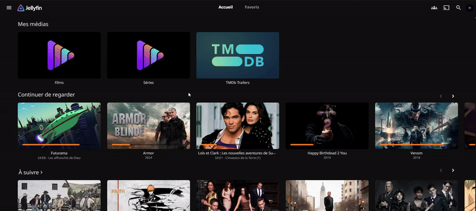
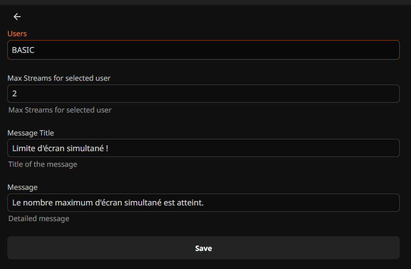

# Jellyfin Stream Limiter Plugin

A Jellyfin plugin that allows you to limit the number of simultaneous streams per user.

## Features

- 🌐 Global default stream limit with per-user overrides
- 🎮 Limit streams per user
- 📝 Customizable messages
- 🔒 Automatic session management


## Example




## Installation

1. Download the latest version of the plugin from releases
2. Extract the zip file to your Jellyfin server's plugins folder
3. Restart your Jellyfin server
4. Configure the plugin in the admin interface

## Configuration

### Plugin Configuration



1. Access the Jellyfin admin interface
2. Go to My extensions > Stream Limiter
3. Configure limits for each user:
   - Select a user
   - Set maximum number of streams
   - Customize limit exceeded messages

### Configuration Options

- **Default Max Streams**: Global default maximum streams for users without an explicit override. Set to 0 for unlimited.
- **Max Streams**: Maximum number of simultaneous streams allowed per user
- **Message Title**: Global title of the message displayed when limit is exceeded
- **Message**: Global detailed text shown to users when they exceed their limit

## Usage

The plugin works automatically once configured:

1. User starts a stream
2. Plugin checks the number of active streams
3. If the limit is exceeded:
   - Stream is stopped
   - Custom message is displayed
   - Session is forcefully disconnected to prevent abuse

## API


The plugin exposes a REST API for programmatic management:

```http
GET /StreamLimit/GetUserStreamLimit
POST /StreamLimit/SetUserStreamLimit
POST /StreamLimit/SetAlertMessage
```

Detailed API documentation is available through Swagger UI at:
```
http://your-server-ip/api-docs/swagger
```
Navigate to the "StreamLimit" section to explore all available endpoints and their parameters.

## Contributing

Contributions are welcome! Feel free to:

1. Fork the project
2. Create a feature branch (`git checkout -b feature/AmazingFeature`)
3. Commit your changes (`git commit -m 'Add some AmazingFeature'`)
4. Push to the branch (`git push origin feature/AmazingFeature`)
5. Open a Pull Request

## License

This project is licensed under the MIT License. See the [LICENSE](LICENSE) file for details.

## Support

For questions or issues:
1. Check the [Issues](../../issues)
2. Create a new issue if needed
3. Join the Jellyfin community 
